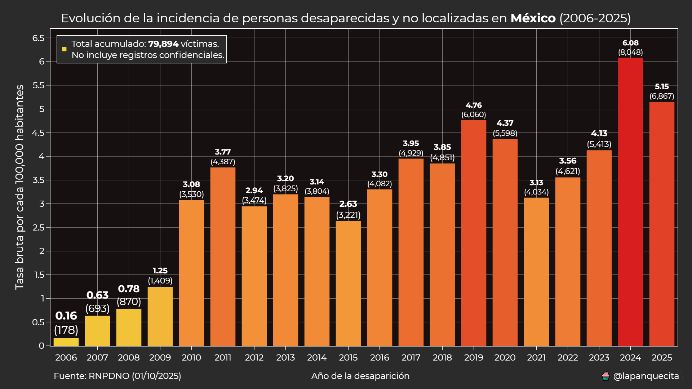
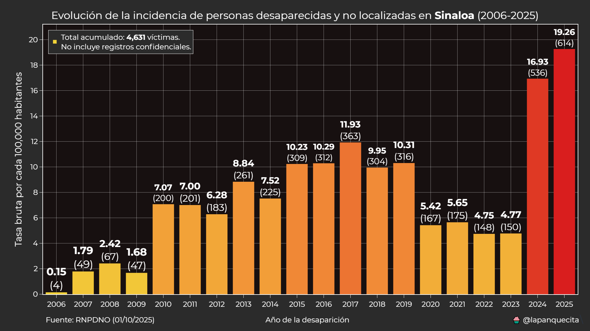
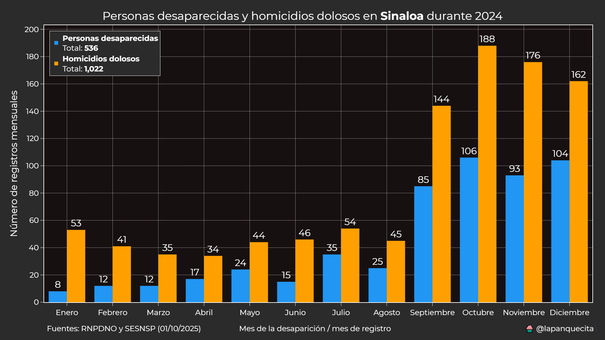
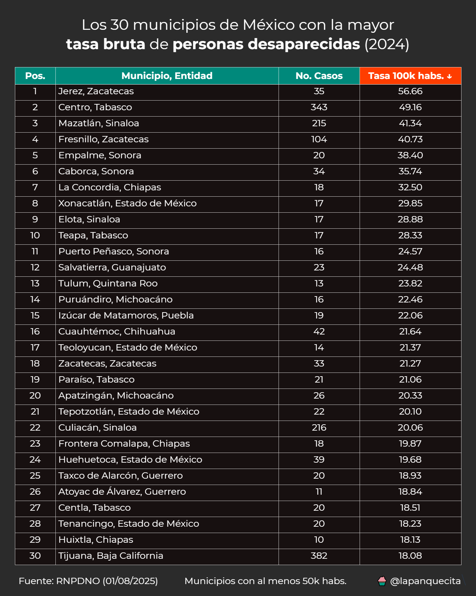
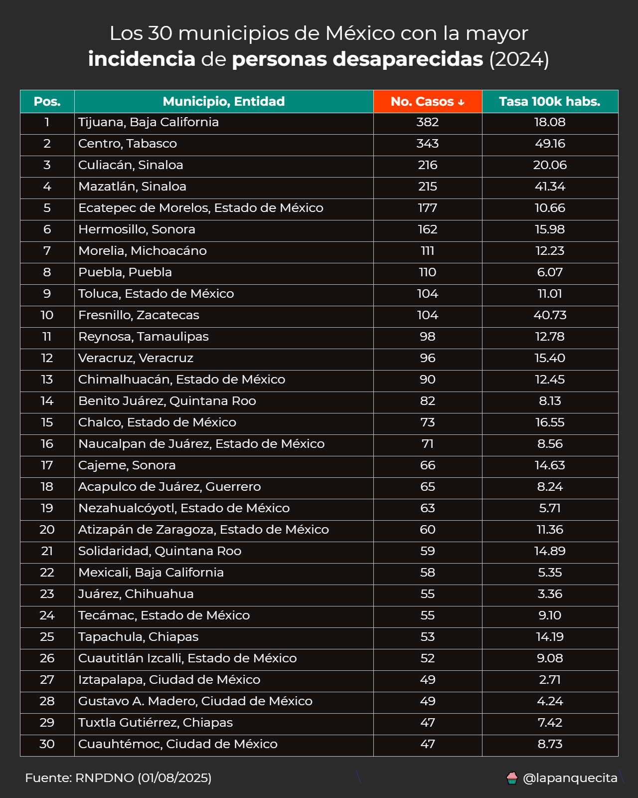
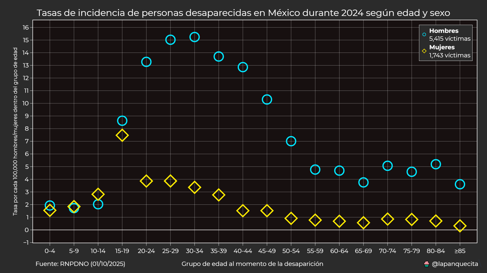

# Personas Desaparecidas y No Localizadas en México

Este repositorio contiene scripts para analizar el Registro Nacional de Personas Desaparecidas y No Localizadas en México.

El conjunto de datos incluido fue generado a partir de la información disponible en: [Consulta Pública del RNPDNO](https://consultapublicarnpdno.segob.gob.mx/consulta).

## Consideraciones

Antes de analizar estos datos, es importante tomar en cuenta los siguientes puntos:

1. Las personas registradas en este listado son consideradas **víctimas**, incluso si su desaparición fue voluntaria.

2. Una misma persona puede aparecer en más de un registro, ya que múltiples instituciones pueden documentar un caso de manera independiente. En los scripts se muestra cómo resolver este problema.

3. Los registros en este conjunto de datos corresponden únicamente a personas que **siguen desaparecidas o no localizadas**. Una vez que se confirma su localización, son eliminados del registro.

4. Algunos registros contienen **información confidencial**. En estos casos, la estrategia aplicada es ignorar dichos campos.

5. Se recomienda utilizar la variable **FECHA_DESAPARICION** en lugar de **FECHA_REGISTRO**. En los scripts se explica qué hacer cuando esta información no está disponible.

## Requisitos

Para utilizar los scripts de este repositorio, se recomienda utilizar la versión 3.13 de Python.

Las dependencias necesarias están especificadas en el archivo `requirements.txt`, el cual contiene la lista de librerías utilizadas por los scripts.

## Análisis

La información pública disponible no es muy extensa, pero aun así permite obtener datos interesantes.

A continuación, se presentan algunos ejemplos de lo que se puede analizar:

### Evolución anual

Lo primero que necesitamos conocer es cuántas personas han sido reportadas como desaparecidas por año de ocurrencia.

Este análisis puede realizarse a nivel nacional:

Y también a nivel estatal:

Si bien las desapariciones y los homicidios no siempre están directamente relacionados, en algunos casos las tendencias sugieren una fuerte correlación. Un ejemplo ilustrativo es el estado de Sinaloa:

Los datos de homicidios provienen del **SESNSP (víctimas)**: [Datos abiertos de incidencia delictiva](https://www.gob.mx/sesnsp/acciones-y-programas/datos-abiertos-de-incidencia-delictiva).

## Comparación estatal

El fenómeno de las desapariciones no afecta por igual a todas las entidades federativas. Para conocer rápidamente la situación de cada estado, se puede utilizar el siguiente mapa:

Otra forma de identificar qué estados presentan un incremento en las desapariciones es mediante la comparación del cambio porcentual:

La gráfica anterior es más efectiva cuando los porcentajes no exceden el 100%.

## Comparación municipal

Aunque en una cantidad considerable de registros no se especifica el municipio, aún es posible identificar las regiones con mayor incidencia:

Esta información también puede presentarse en formato de tabla:

Además, la misma tabla está disponible ordenada por cifras absolutas:

### Comparación demográfica

Cualquier persona puede estar en riesgo de sufrir una desaparición.

La siguiente gráfica de dispersión permite identificar qué grupos de edad son los más afectados:

## Conclusión

A pesar de las limitaciones del conjunto de datos original, es posible identificar información clave sobre este problema tan relevante en México.

Este repositorio se seguirá actualizando con nueva información.

Espero que el contenido te sea útil. Por supuesto, eres libre de utilizarlo, adaptarlo y distribuirlo según tus necesidades.